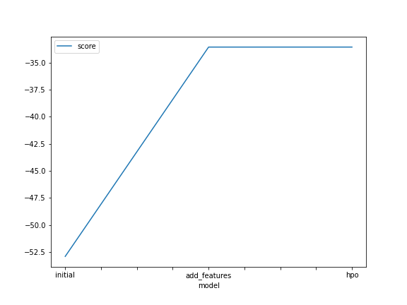
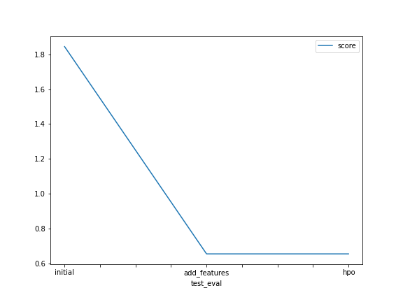

# Report: Predict Bike Sharing Demand with AutoGluon Solution
#### EDIDIONG ALIGBE

## Initial Training
### What did you realize when you tried to submit your predictions? What changes were needed to the output of the predictor to submit your results?
TODO: The change made to the predictions was to make sure that there are no negative values. 

### What was the top ranked model that performed?
TODO: WeightedEnsemble_L3

## Exploratory data analysis and feature creation
### What did the exploratory analysis find and how did you add additional features?
TODO: The EDA found out that the datetime feature should be broken apart to be able to derive better predictions . I added additional features by spliting the datetime feature into month, hour and day 

### How much better did your model preform after adding additional features and why do you think that is?
TODO: The model performed better by 6.380403. It performed better because it had additional features to help it train better.

## Hyper parameter tuning
### How much better did your model preform after trying different hyper parameters?
TODO: The model did not perform well when i introduced hyperparameters.

### If you were given more time with this dataset, where do you think you would spend more time?
TODO: I will spend more time at trying different hyperparameters to improve the performance of the model.

### Create a table with the models you ran, the hyperparameters modified, and the kaggle score.
|model|hpo1|hpo2|hpo3|score|
|--|--|--|--|--|
|initial|none|none|none|1.79153|
|add_features|none|none|none|0.68949|
|hpo|num_trials|scheduler|searcher|0.6245|

### Create a line plot showing the top model score for the three (or more) training runs during the project.

TODO: Replace the image below with your own.

### Create a line plot showing the top kaggle score for the three (or more) prediction submissions during the project.

TODO: Replace the image below with your own.

## Summary
TODO: None
